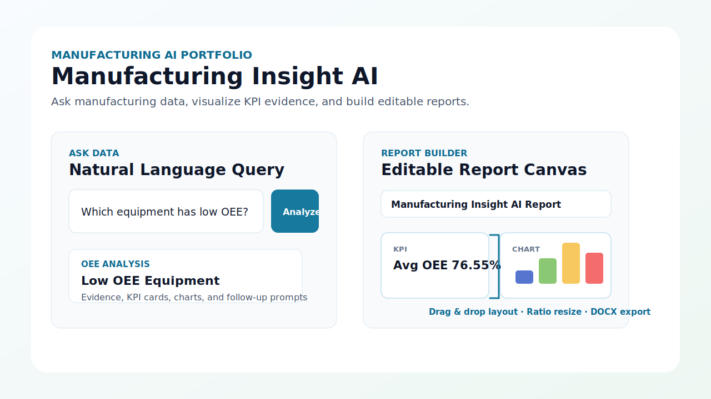
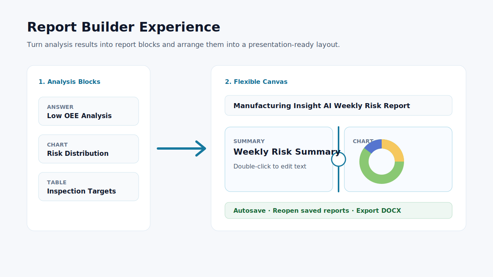
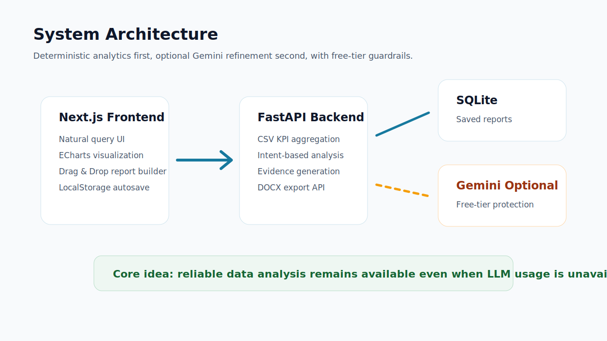

# Manufacturing Insight AI

제조 설비 데이터를 자연어로 질의하고, 분석 근거와 차트를 포함한 보고서를 직접 구성할 수 있는 제조 AI 포트폴리오 프로젝트입니다.

<p align="center">
  
</p>

## 프로젝트 개요

Manufacturing Insight AI는 제조 현장의 설비 KPI 데이터를 기반으로 운영 상태를 분석하고, 그 결과를 보고서 형태로 편집할 수 있는 웹 애플리케이션입니다. 사용자는 “OEE가 가장 낮은 설비는?”, “어떤 설비를 먼저 점검해야 해?” 같은 질문을 입력하고, 시스템은 규칙 기반 분석 또는 선택적 Gemini 보강을 통해 답변, 근거 KPI, 차트, 상세 데이터를 제공합니다.

이 프로젝트는 단순 챗봇이 아니라 제조 데이터 분석부터 보고서 작성까지 이어지는 업무형 AI 서비스를 포트폴리오로 보여주는 것을 목표로 합니다.

## 문제 정의

제조 데이터는 설비 ID, 라인, OEE, 가동률, 품질률, 위험도, 정비 우선순위처럼 여러 지표가 함께 존재합니다. 실제 업무에서는 데이터를 보는 것에서 끝나지 않고, 분석 결과를 정리해 보고서로 전달해야 합니다.

이 프로젝트는 다음 문제를 해결하는 방향으로 설계했습니다.

- 비전문가도 자연어 질문으로 제조 데이터를 탐색할 수 있어야 합니다.
- 답변에는 어떤 데이터와 KPI를 근거로 판단했는지 표시되어야 합니다.
- 데이터 특성에 맞는 차트가 자동으로 추천되어야 합니다.
- 보고서는 사용자가 원하는 레이아웃으로 재구성할 수 있어야 합니다.
- 무료 LLM 사용량이 소진되거나 API 키가 없어도 기본 분석 기능은 동작해야 합니다.

## 핵심 기능

<p align="center">
  
</p>

### 1. 제조 데이터 자연어 질의

- 설비 상태, OEE 하위 설비, 위험 설비, 정비 우선순위, 라인별 상태 등을 질문할 수 있습니다.
- 백엔드에서 CSV 데이터를 직접 집계해 결정적인 분석 결과를 생성합니다.
- Gemini API 키가 없으면 규칙 기반 분석 모드로 동작합니다.
- Gemini API 키가 있으면 무료 한도 보호 정책 안에서 답변 설명을 보강합니다.

### 2. 근거 중심 분석 결과

- AI 답변 아래에 분석 근거를 표시합니다.
- 사용된 KPI, 필터 조건, 데이터 행 수, 계산 방식을 확인할 수 있습니다.
- 설비 ID를 클릭하면 해당 설비의 KPI, 센서값, 정비 상태를 상세 패널로 볼 수 있습니다.

### 3. 자동 추천 차트와 차트 변경

- 분석 의도에 맞는 기본 차트를 자동으로 생성합니다.
- 예시:
  - 라인별 OEE 비교: 막대 차트
  - 위험도 분포: 도넛 차트
  - 공구 마모와 생산량 관계: 산점도
- 사용자는 드롭다운으로 차트 유형을 변경할 수 있습니다.

### 4. 드래그앤드롭 보고서 빌더

- 답변, KPI, 차트, 테이블, 추천 질문을 보고서 블록으로 추가할 수 있습니다.
- 블록을 위아래로 이동하거나 다른 블록 옆으로 드래그해 2열 레이아웃을 만들 수 있습니다.
- 2열 레이아웃은 가운데 핸들을 드래그해 비율을 조정할 수 있습니다.
- 텍스트 블록은 더블클릭으로 직접 수정할 수 있습니다.
- 작성 중인 보고서는 브라우저 LocalStorage에 임시저장되어 새로고침 후에도 복원됩니다.

### 5. 보고서 저장과 DOCX 다운로드

- 보고서는 SQLite에 저장하고 나중에 다시 불러와 수정할 수 있습니다.
- 저장된 보고서는 DOCX 파일로 다운로드할 수 있습니다.
- HWPX/PDF 내보내기는 향후 확장 항목으로 남겨두었습니다.

## 시스템 아키텍처

<p align="center">
  
</p>

| 영역 | 사용 기술 | 역할 |
| --- | --- | --- |
| Frontend | Next.js, React, TypeScript | 질의 화면, 차트 렌더링, 보고서 편집 UI |
| Visualization | Apache ECharts | 막대, 도넛, 라인, 산점도, 테이블 시각화 |
| Drag & Drop | dnd-kit | 보고서 블록 이동 및 자동 행 레이아웃 구성 |
| Backend | FastAPI, Python | CSV 분석, API 제공, 보고서 저장, DOCX 생성 |
| Storage | SQLite | 저장된 보고서 관리 |
| LLM | Gemini API 선택 연동 | 무료 한도 내 답변 설명 보강 |
| Export | python-docx | 저장 보고서 DOCX 다운로드 |

## 현재 구현 상태

| 기능 | 상태 |
| --- | --- |
| 제조 CSV 데이터 분석 | 구현 완료 |
| 자연어 질의 라우팅 | 구현 완료 |
| 규칙 기반 분석 모드 | 구현 완료 |
| Gemini Free Tier 보호 모드 | 구현 완료 |
| 차트 자동 추천 | 구현 완료 |
| 차트 타입 변경 | 구현 완료 |
| 보고서 블록 추가 | 구현 완료 |
| 드래그앤드롭 레이아웃 편집 | 구현 완료 |
| 2열 비율 조정 | 구현 완료 |
| 텍스트 블록 직접 편집 | 구현 완료 |
| LocalStorage 임시저장 | 구현 완료 |
| SQLite 보고서 저장/불러오기 | 구현 완료 |
| DOCX 다운로드 | 구현 완료 |

## 데이터 분석 시나리오

이 프로젝트는 `data/manufacturing_data.csv`를 사용합니다. 주요 분석 시나리오는 다음과 같습니다.

- 전체 설비 운영 상태 요약
- OEE 하위 설비 Top N 조회
- High Risk 설비 탐지
- 라인별 OEE 및 위험도 비교
- 정비 우선순위 추천
- 생산량 저하와 공구 마모 관계 분석
- 설비 단건 상세 분석

## LLM 비용 통제 정책

포트폴리오 시연 중 예상치 못한 과금이 발생하지 않도록 LLM 호출은 보조 기능으로 분리했습니다.

- Gemini API 키가 없으면 외부 LLM 호출 없이 규칙 기반 분석 모드로 동작합니다.
- Gemini API 키가 있더라도 백엔드에서 일일 사용자/전체 사용량을 확인합니다.
- 사용량이 소진되면 LLM 호출을 건너뛰고 “무료 AI 사용량이 소진되었습니다” 메시지를 표시합니다.
- 데이터 분석, 차트, 보고서 편집, DOCX 다운로드는 LLM 없이 계속 사용할 수 있습니다.
- Google Cloud Billing 연결 없이 무료 한도 사용을 전제로 설계했습니다.

## 로컬 실행 방법

### 1. 백엔드 실행

```bash
cd backend
python -m venv .venv
.venv\Scripts\activate
pip install -r requirements.txt
copy .env.example .env
uvicorn app.main:app --reload --host 0.0.0.0 --port 8000
```

`backend/.env`의 `GEMINI_API_KEY`는 선택 사항입니다. 비워두면 규칙 기반 분석 모드로 실행됩니다.

### 2. 프론트엔드 실행

```bash
cd frontend
npm install
copy .env.example .env.local
npm run dev
```

브라우저에서 `http://localhost:3000`으로 접속합니다.


## 무료 배포 전략

이 프로젝트는 정적 프론트엔드와 FastAPI 백엔드를 분리해서 무료 배포할 수 있도록 구성했습니다.

| 대상 | 배포 위치 | 이유 |
| --- | --- | --- |
| Frontend | GitHub Pages | Next.js 정적 export 결과를 무료로 호스팅 |
| Backend | Hugging Face Spaces Docker | FastAPI 서버를 무료 CPU Space로 실행 |

### 1. Hugging Face Spaces 백엔드 배포

GitHub Actions 워크플로 `Deploy Backend to Hugging Face Spaces`를 사용합니다.

1. Hugging Face에서 Write 권한 Access Token을 생성합니다.
2. GitHub 저장소의 `Settings > Secrets and variables > Actions > Secrets`에 `HF_TOKEN`을 추가합니다.
3. Gemini를 사용할 경우 같은 Secrets 위치에 `GEMINI_API_KEY`도 추가합니다. 이 값은 코드에 포함하지 않고 Hugging Face Space Secret으로만 동기화됩니다.
4. 필요한 경우 `Settings > Secrets and variables > Actions > Variables`에 `GEMINI_MODEL`, `LLM_DAILY_USER_LIMIT`, `LLM_DAILY_GLOBAL_LIMIT`, `LLM_MAX_OUTPUT_TOKENS`, `CORS_ORIGINS`를 추가합니다.
5. `main` 브랜치에 push하면 `Deploy to Hugging Face Spaces` 워크플로가 자동 실행됩니다. 수동 실행도 가능합니다.
6. Space ID는 `min-bok/manufacturing-insight-ai`입니다.
7. 배포가 완료되면 백엔드 URL은 다음 형식이 됩니다.

```text
https://min-bok-manufacturing-insight-ai.hf.space
```

Hugging Face 무료 Space는 사용하지 않을 때 sleep 될 수 있습니다. 첫 접속 시 응답이 느릴 수 있지만, 자동 과금 없이 포트폴리오 시연용으로 사용하기 좋습니다.

### 2. GitHub Pages 프론트엔드 배포

GitHub Actions 워크플로 `Deploy Frontend to GitHub Pages`를 사용합니다.

1. GitHub 저장소의 `Settings > Pages`에서 Source를 `GitHub Actions`로 설정합니다.
2. 필요한 경우 `Settings > Secrets and variables > Actions > Variables`에 `NEXT_PUBLIC_API_BASE_URL`을 추가합니다.
3. 값은 Hugging Face Spaces 백엔드 URL로 설정합니다.

```text
NEXT_PUBLIC_API_BASE_URL=https://min-bok-manufacturing-insight-ai.hf.space
```

기본값도 위 URL로 설정되어 있어, Space ID를 그대로 사용한다면 별도 변수 없이 Pages 빌드가 가능합니다.
## 프로젝트 구조

```text
backend/      FastAPI API, CSV 분석, Gemini 연동, 보고서 저장/내보내기
frontend/     Next.js UI, 차트, 보고서 빌더
data/         제조 설비 CSV 데이터
docs/         데이터 사전, 도메인 문서, README 이미지
```

로컬 전용 파일인 `.Agent/`, `.runtime/`, `ignore/`, `.env`, `.venv`, `node_modules`, `.next`는 Git에 포함하지 않습니다.

## 포트폴리오 관점의 강점

- 제조 도메인의 KPI와 정비 우선순위를 실제 UI 흐름에 녹였습니다.
- 단순 LLM 답변이 아니라 데이터 집계, 차트, 보고서 편집까지 하나의 업무 흐름으로 연결했습니다.
- LLM 비용과 실패 가능성을 고려해 규칙 기반 분석을 기본값으로 설계했습니다.
- Explainability, 설비 상세 패널, 템플릿, 임시저장, DOCX 다운로드처럼 실제 서비스에서 기대할 기능을 MVP에 포함했습니다.

## 향후 개선 방향

- 보고서 블록을 차트 이미지까지 포함해 DOCX에 더 정교하게 내보내기
- PDF/HWPX 내보내기 추가
- 사용자 로그인과 서버 기반 자동 저장
- 실제 제조 DB 또는 MES/설비 센서 API 연동
- 더 많은 분석 유형과 이상 탐지 모델 추가
- 보고서 템플릿 관리 화면 고도화
